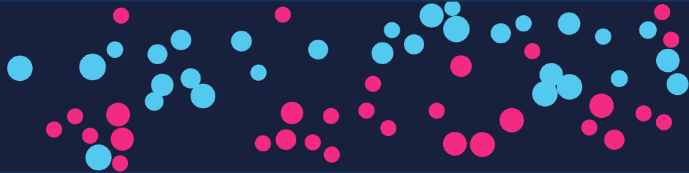

This repo is an experiment in automated replication/reimplementation of the model described in

> Moussaïd, M., Helbing, D., & Theraulaz, G. (2011). How simple rules determine pedestrian behavior and crowd disasters. *PNAS*, 108(17), 6884-6888.

- coding agent: Cursor v2.4.27
- model: Claude Opus 4.5 (thinking)

### Full log of instructions

#### Instructions to agent 1:
1. `(Given pdfs of the paper and supporting information)` in this folder we have a paper and supporting information (methods/materials/etc). we want to reimplement the simulations exactly as described. read through the paper and create a detailed spec document outlining methods and everything we will need to reimplement the simulations perfectly. make sure to interview me about any design decisions like language, etc.

#### Instructions to agent 2:
1. `(SPEC.md)` contains a detailed specification of software that reimplements simulations described in the paper also in this folder. It is all ready to go. go ahead and implement it
2. some issues with the controls. the scenarios are not selectable. start/pause/etc work. model params are shown but not editable. visualization like show velocity/color are toggleable but it is not visually apparent what is toggled
3. nothing changed. maybe we should try something other than dat.gui? i still just see "scenario" with no option to change it, and model parameters just say for example "d_max (horizon, m)" and can't be edited.
4. can you check the bidirectional/unidirectional/bottleneck scenarios? it seems like they go the direction of whatever side they spawn on

The last instruction prompted the only real functional change made since the initial implementation, the issue (which got fixed) according to the agent was:
> The periodic boundary logic is "finding the shortest path on a torus" but that causes pedestrians to take the shortcut around the boundary instead of walking through the crowd.
> The fix: pedestrians should always walk in their intended direction. Periodic wrapping should only apply to position wrapping and collision detection with nearby pedestrians, NOT for choosing which way to walk.

# GENERATED README: Pedestrian Simulation: Moussaïd et al. 2011 Replication

A browser-based replication of the cognitive heuristics pedestrian model from:

> Moussaïd, M., Helbing, D., & Theraulaz, G. (2011). How simple rules determine pedestrian behavior and crowd disasters. *PNAS*, 108(17), 6884-6888.

## Overview

This simulation implements two behavioral heuristics based on visual information to determine pedestrian walking direction and speed:

1. **Direction Selection**: Choose the direction that minimizes distance to destination while avoiding obstacles
2. **Speed Selection**: Maintain safe distance based on reaction time

Combined with physical contact forces for high-density scenarios, this model reproduces:
- Lane formation in bidirectional flow
- Stop-and-go waves in unidirectional flow
- Crowd turbulence at bottlenecks
- Evacuation dynamics

## How to run the model

```bash
npm install
npm run dev
```

## Scenarios

### 1. Single Pedestrian
Validates acceleration behavior without interactions (Fig. S1)

### 2. Two Pedestrian (Static)
Avoidance trajectory around a stationary obstacle (Fig. 2A)

### 3. Two Pedestrian (Moving)
Avoidance when both pedestrians are moving toward each other (Fig. 2B)

### 4. Bidirectional Flow
Spontaneous lane formation with pedestrians walking in opposite directions (Fig. S2)

### 5. Unidirectional Flow
Velocity-density relationship and stop-and-go wave emergence (Fig. 3)

### 6. Bottleneck
Crowd turbulence and high-density conditions (Fig. 4)

### 7. Turning Corridor
90° turn under high density conditions (Fig. S4)

### 8. Evacuation
Room evacuation with varying door widths (Fig. S5)

## Model Parameters

| Parameter | Symbol | Default | Description |
|-----------|--------|---------|-------------|
| Relaxation time | τ | 0.5 s | Time to adjust to desired velocity |
| Vision half-angle | φ | 75° | Angular extent of vision |
| Horizon distance | d_max | 10 m | Maximum perception distance |
| Contact stiffness | k | 5000 kg/s² | Body collision force coefficient |
